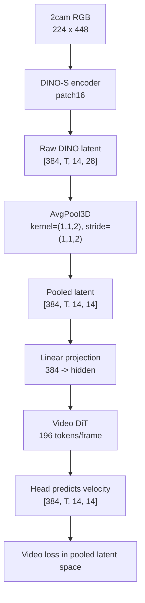
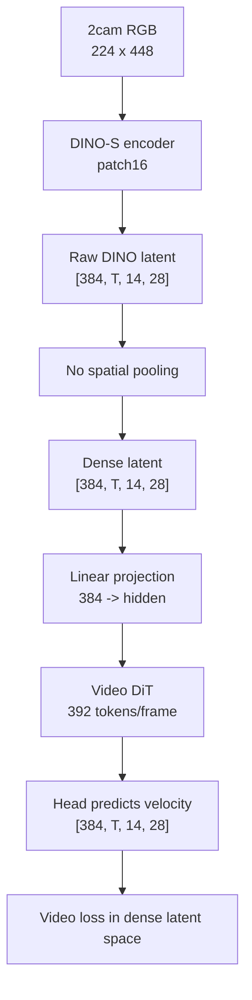
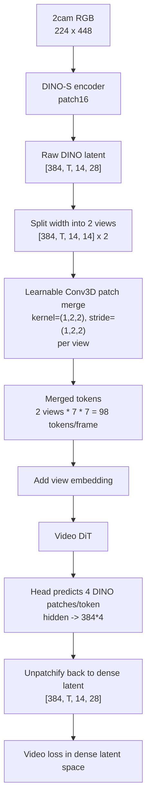
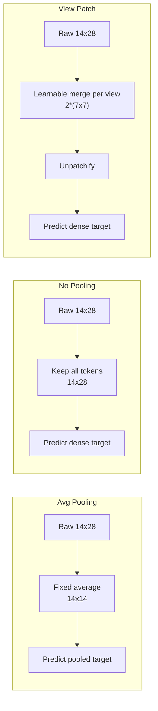
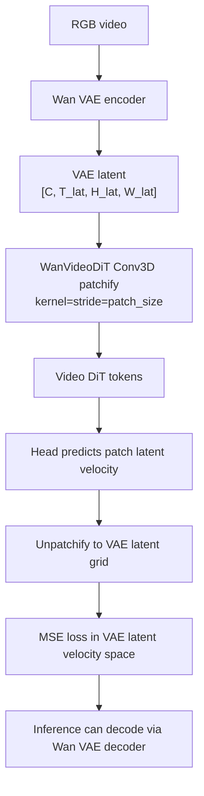
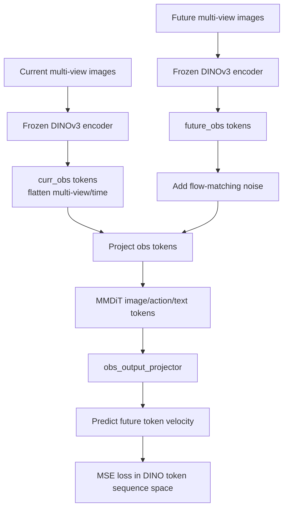
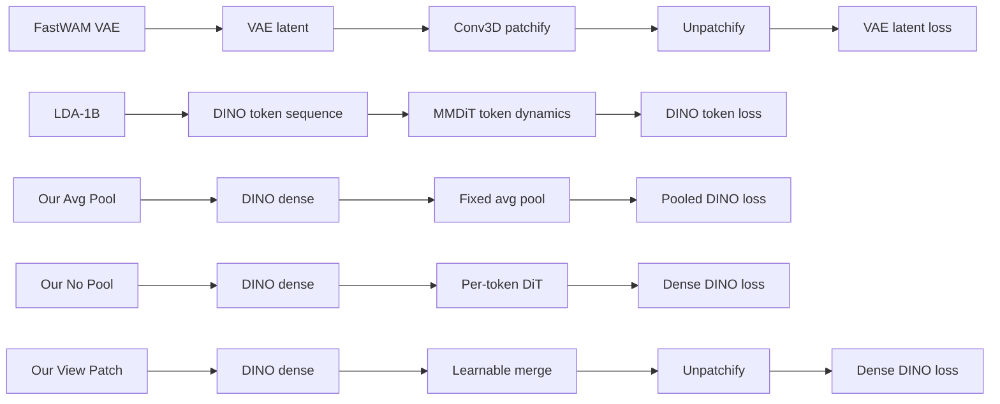

# DINO / VAE Token Processing Comparison

本文对比当前 LIBERO DINO-S 2cam 224x448 设置下三种 DINO token 处理方式，并补充原 FastWAM 的 VAE latent 路线、LDA-1B 的 DINO token dynamics 路线：

- Avg Pooling：早期 `latent_spatial_pool=[1,2]`
- No Pooling：当前最高分 no-pool baseline，`latent_spatial_pool=[1,1]`
- View-Aware Patch Merge：当前 viewpatch `[1,2,2]`
- FastWAM VAE latent：原始 FastWAM/Wan VAE latent + WanVideoDiT patchify/unpatchify
- LDA-1B DINO token dynamics：DINOv3 token 序列 + MMDiT token-space dynamics loss

输入图像为双相机横向拼接 `224x448`，DINO patch size 为 `16`，因此原始 DINO latent 空间为：

```text
[D, T, H, W] = [384, T, 14, 28]
```

其中 `W=28` 可以看作两个相机 view 拼接后：

```text
view0: 14x14, view1: 14x14
```

---

## 1. 总览

| 方案 | latent / feature | DiT token / frame | DiT 输入方式 | DiT 输出监督空间 | 主要特点 |
|---|---:|---:|---|---|---|
| Avg Pooling | `[384,T,14,14]` | `196` | 宽度方向相邻 token 平均后线性投影 | pooled latent `[384,T,14,14]` | 快，监督更容易，但横向细节被平均掉 |
| No Pooling | `[384,T,14,28]` | `392` | 每个 DINO patch 一个 token | dense latent `[384,T,14,28]` | 信息最完整，当前最好结果，但慢 |
| View Patch `[1,2,2]` | `[384,T,14,28]` | `98` | 每个 view 内 `2x2` patch learnable merge | dense latent `[384,T,14,28]` | token 最少，但需要从压缩 token 还原 dense latent，当前 video loss 高 |
| FastWAM VAE | VAE latent `[C,T,H,W]` | 取决于 VAE grid 和 DiT patch | Conv3D patchify latent | VAE latent velocity | 和 Wan 预训练最一致，目标是可解码生成 latent |
| LDA-1B DINO | DINOv3 token sequence | 多 view * DINO tokens | token projection / 时间拼接投影 + MMDiT | DINO token velocity | DINO 路线默认不做空间 `2x2` merge，不还原 dense grid |

当前代表结果：

| 方案 | 代表 checkpoint | global bs | 等效 epoch | Overall | Spatial | Object | Goal | LIBERO-10 |
|---|---|---:|---:|---:|---:|---:|---:|---:|
| No Pooling lr1e-5 from `028930` | `step_028930` | `96` | `20.00` | `96.25` | `98.00` | `98.33` | `98.67` | `90.00` |
| No Pooling lr1e-5 from `028930` | `step_028000` | `96` | `19.68` | `95.08` | `97.67` | `99.00` | `96.67` | `87.00` |
| No Pooling lr1e-5 from `028930` | `step_026000` | `96` | `18.99` | `95.08` | `97.67` | `99.00` | `97.33` | `86.33` |
| Avg Pooling lr1e-5 from `043400` 10ep base | `step_018000` | `128` | `18.29` | `95.17` | `95.33` | `97.33` | `98.00` | `90.00` |
| Avg Pooling lr1e-5 from `043400` 10ep base | `step_020000` | `128` | `19.22` | `94.67` | `96.00` | `97.33` | `96.00` | `89.33` |
| Avg Pooling lr1e-5 from `043400` 10ep base | `step_014000` | `128` | `16.45` | `94.58` | `96.33` | `97.00` | `96.67` | `88.33` |
| Avg Pooling lr1e-5 from `043400` 10ep base | `step_010000` | `128` | `14.61` | `93.75` | `97.67` | `96.67` | `93.67` | `87.00` |
| Avg Pooling lr1e-5 from `043400` 10ep base | `step_021000` | `128` | `19.68` | `93.50` | `93.67` | `97.00` | `97.00` | `86.33` |
| No Pooling fresh | `step_028930` | `96` | `10.00` | `93.58` | `98.67` | `99.33` | `92.33` | `84.00` |
| Short-DINO-Intent context-after-proprio best | `step_022000` | `96` | `7.60` | `90.58` | `92.33` | `100.00` | `95.00` | `75.00` |
| Short-DINO-Intent context-after-proprio 10ep | `step_028930` | `96` | `10.00` | `90.00` | `93.33` | `98.67` | `90.33` | `77.67` |
| View Patch `[1,2,2]` | `step_032000` | `128` | `14.75` | `91.75` | `95.00` | `98.33` | `96.33` | `77.33` |
| View Patch `[1,2,2]` merged-token loss | `step_021700` | `128` | `10.00` | `86.25` | `95.67` | `98.33` | `86.33` | `64.67` |
| DINO smallvideo framecache | `step_042000` | `64` | `9.68` | `93.58` | `96.67` | `99.33` | `95.33` | `83.00` |
| FastWAM VAE smallvideo | `step_021700` | `256` | `20.00` | `91.33` | `92.00` | `98.00` | `94.00` | `81.33` |
| FastWAM VAE smallvideo loss-aligned `0.05/5.0` | `step_057860` | `96` | `20.00` | `75.83` | `71.67` | `94.67` | `83.33` | `53.67` |

等效 epoch 按当前 LIBERO 数据量换算：

```text
21700 steps * global_bs 256 / 20 epoch = 277760 samples / epoch
等效 epoch = step * global_bs / 277760
```

对于 weight-only finetune，表中使用累计等效 epoch：

```text
累计等效 epoch = base_step * base_global_bs / 277760
               + new_step * new_global_bs / 277760
```

### 1.1 当前评测 leaderboard

| Rank | 方案 / run | checkpoint | global bs | 等效 epoch | Spatial | Object | Goal | LIBERO-10 | Overall |
|---:|---|---|---:|---:|---:|---:|---:|---:|---:|
| 1 | No Pooling lr1e-5 from `028930` | `step_028930` | `96` | `20.00` | `98.00` | `98.33` | `98.67` | `90.00` | `96.25` |
| 2 | Avg Pooling lr1e-5 from `043400` 10ep base | `step_018000` | `128` | `18.29` | `95.33` | `97.33` | `98.00` | `90.00` | `95.17` |
| 3 | No Pooling lr1e-5 from `028930` | `step_028000` | `96` | `19.68` | `97.67` | `99.00` | `96.67` | `87.00` | `95.08` |
| 3 | No Pooling lr1e-5 from `028930` | `step_026000` | `96` | `18.99` | `97.67` | `99.00` | `97.33` | `86.33` | `95.08` |
| 5 | No Pooling lr1e-5 from `028930` | `step_020000` | `96` | `16.91` | `96.67` | `99.33` | `97.00` | `86.67` | `94.92` |
| 6 | No Pooling lr1e-5 from `028930` | `step_022000` | `96` | `17.60` | `98.00` | `98.33` | `96.67` | `86.00` | `94.75` |
| 6 | No Pooling lr1e-5 from `028930` | `step_024000` | `96` | `18.30` | `98.33` | `99.00` | `95.67` | `86.00` | `94.75` |
| 8 | Avg Pooling lr1e-5 from `043400` 10ep base | `step_020000` | `128` | `19.22` | `96.00` | `97.33` | `96.00` | `89.33` | `94.67` |
| 9 | Avg Pooling lr1e-5 from `043400` 10ep base | `step_014000` | `128` | `16.45` | `96.33` | `97.00` | `96.67` | `88.33` | `94.58` |
| 10 | Avg Pooling lr1e-5 from `043400` 10ep base | `step_021700` | `128` | `20.00` | `93.67` | `98.33` | `95.67` | `88.33` | `94.00` |
| 11 | No Pooling lr1e-5 from `028930` | `step_016000` | `96` | `15.53` | `96.00` | `96.33` | `97.33` | `85.67` | `93.83` |
| 12 | Avg Pooling lr1e-5 from `043400` 10ep base | `step_010000` | `128` | `14.61` | `97.67` | `96.67` | `93.67` | `87.00` | `93.75` |
| 13 | DINO smallvideo framecache | `step_042000` | `64` | `9.68` | `96.67` | `99.33` | `95.33` | `83.00` | `93.58` |
| 13 | No Pooling fixed finetune from `028930` | `step_004000` | `96` | `11.38` | `96.67` | `99.67` | `95.67` | `82.33` | `93.58` |
| 13 | No Pooling fresh | `step_028930` | `96` | `10.00` | `98.67` | `99.33` | `92.33` | `84.00` | `93.58` |
| 16 | DINO smallvideo lv1 from `040000` | `step_052000` | `128` | `23.96` | `98.33` | `99.00` | `92.33` | `84.33` | `93.50` |
| 16 | Avg Pooling lr1e-5 from `043400` 10ep base | `step_021000` | `128` | `19.68` | `93.67` | `97.00` | `97.00` | `86.33` | `93.50` |
| 18 | No Pooling lr1e-5 from `028930` | `step_008000` | `96` | `12.77` | `96.67` | `98.67` | `93.33` | `84.67` | `93.33` |
| 18 | No Pooling lr1e-5 from `028930` | `step_004000` | `96` | `11.38` | `97.67` | `99.33` | `97.00` | `79.33` | `93.33` |
| 20 | DINO smallvideo framecache | `step_040000` | `64` | `9.22` | `96.00` | `98.33` | `93.33` | `85.33` | `93.25` |
| 21 | DINO smallvideo framecache | `step_038000` | `64` | `8.76` | `98.00` | `100.00` | `93.00` | `81.00` | `93.00` |
| 21 | No Pooling fresh | `step_026000` | `96` | `8.99` | `96.67` | `99.67` | `92.33` | `83.33` | `93.00` |
| 23 | DINO smallvideo framecache | `step_043400` | `64` | `10.00` | `95.67` | `99.00` | `94.67` | `82.00` | `92.83` |
| 24 | No Pooling lr1e-5 from `028930` | `step_012000` | `96` | `14.15` | `96.67` | `98.67` | `95.33` | `80.00` | `92.67` |
| 25 | View Patch `[1,2,2]` full resume | `step_032000` | `128` | `14.75` | `95.00` | `98.33` | `96.33` | `77.33` | `91.75` |
| 26 | FastWAM VAE smallvideo | `step_021700` | `256` | `20.00` | `92.00` | `98.00` | `94.00` | `81.33` | `91.33` |
| 27 | View Patch `[1,1,2]` lr2e-5 from `024000` | `step_020000` | `96` | `15.21` | `93.00` | `100.00` | `96.67` | `74.33` | `91.00` |
| 27 | FastWAM VAE smallvideo lr1e-5 from `021700` | `step_002000` | `256` | `21.84` | `89.67` | `97.67` | `95.00` | `81.67` | `91.00` |
| 29 | Short-DINO-Intent context-after-proprio | `step_022000` | `96` | `7.60` | `92.33` | `100.00` | `95.00` | `75.00` | `90.58` |
| 30 | View Patch `[1,2,2]` weightonly from `032000` | `step_008000` | `128` | `18.43` | `93.67` | `98.00` | `94.00` | `75.00` | `90.17` |
| 30 | FastWAM VAE smallvideo | `step_020000` | `256` | `18.43` | `91.33` | `97.00` | `94.00` | `78.33` | `90.17` |
| 32 | FastWAM VAE smallvideo lr1e-5 from `021700` | `step_004000` | `256` | `23.69` | `89.67` | `97.67` | `93.00` | `79.67` | `90.00` |
| 32 | Short-DINO-Intent context-after-proprio | `step_028930` | `96` | `10.00` | `93.33` | `98.67` | `90.33` | `77.67` | `90.00` |
| 34 | Short-DINO-Intent context-after-proprio | `step_028000` | `96` | `9.68` | `92.00` | `99.67` | `90.33` | `77.67` | `89.92` |
| 35 | FastWAM VAE smallvideo | `step_018000` | `256` | `16.59` | `90.00` | `97.67` | `94.67` | `76.67` | `89.75` |

说明：完整 leaderboard 已更新到 `libero_dashboard/dashboard_data.json`，当前共 `59` 个 eval。Short-DINO-Intent context-after-proprio 的 best 是 `step_022000`，`90.58 Overall / 75.00 LIBERO-10`；10ep endpoint `step_028930` 是 `90.00 Overall / 77.67 LIBERO-10`，低于 no-intent fresh 10ep 的 `93.58 Overall / 84.00 LIBERO-10`。VAE loss-aligned `0.05/5.0` 不在 top 35 内，best 为 `step_054000`，`76.08 Overall / 54.67 LIBERO-10`；20ep endpoint `step_057860` 为 `75.83 Overall / 53.67 LIBERO-10`。

---

## 2. Avg Pooling

配置：

```text
model.dino_config.latent_spatial_pool=[1,2]
```

流程：



关键点：

- token 数从 `14*28=392` 降到 `14*14=196`。
- loss 直接在 pooled latent 上算，目标更容易。
- 宽度方向每两个 DINO token 平均，相当于每个 view 内 `14x14 -> 14x7`，会损失小物体、夹爪接触和横向精定位信息。
- 双相机边界通常不会被跨 view 平均，因为 `28` 宽度正好分成两个 `14` view，`kernel=2` 从偶数位置滑动。

最新 30-trial 结果：

- `avgpool [1,2]` 从 `step_043400` 的 10epoch base 做 lr1e-5 weight-only 续训后，`step_018000` 达到 `95.17 Overall / 90.00 LIBERO-10`。
- 这说明 avgpool 继续训可以明显补回一部分差距，长任务 `LIBERO-10` 已经追平 no-pool best 的 `90.00`。
- 但综合分仍低于 no-pool 20epoch best `96.25`，且 `step_020000`、`step_021000` 开始回落；因此当前结论是 avgpool 可作为高效路线保留，但还没有超过 no-pool。

---

## 3. No Pooling

配置：

```text
model.dino_config.latent_spatial_pool=[1,1]
```

流程：



关键点：

- token 数最高：`392 tokens/frame`。
- 每个 DINO patch token 独立进入 DiT，信息保留最完整。
- 训练慢，但目前成功率最高。
- 当前 no-pool 后期 wandb 上 `train/loss_video` 常到 `0.002` 以下。注意日志中的 `loss_video` 是乘过 `lambda_video=0.05` 的加权值，因此未加权 video loss 约为 `0.04` 以下。

---

## 4. View-Aware Patch Merge

配置：

```text
model.dino_config.latent_spatial_pool=[1,1]
model.video_dit_config.latent_patch_size=[1,2,2]
model.video_dit_config.latent_patch_mode=view
model.video_dit_config.latent_num_views=2
```

流程：



关键点：

- token 数最低：`98 tokens/frame`，只有 no-pool 的 `1/4`。
- 不跨相机 view merge，每个 view 内 `14x14 -> 7x7`。
- 与 avg pooling 不同，它不是固定平均，而是 learnable merge。
- 但是当前实现的 loss 仍然在 dense no-pool latent 上算：模型必须从一个 token 还原 `2x2` 内部的 `4*384=1536` 维 DINO velocity。
- 因此它比 avg pooling 更合理，但训练目标也更难。

当前现象：

```text
viewpatch train/loss_video ~= 0.018 - 0.020
lambda_video = 0.05
未加权 video loss ~= 0.36 - 0.40
```

而 no-pool 后期：

```text
no-pool train/loss_video <= 0.002
lambda_video = 0.05
未加权 video loss <= 0.04
```

所以 viewpatch 当前 video latent prediction 误差大约高一个数量级。这不是因为分成两个 view 导致 loss 变成 2 倍；loss 代码对 `D,H,W` 取 mean，两个 view 只是空间重排，不会天然乘 2。

更可能的原因：

- 一个 token 要表达 `2x2` patch 内的细节，压缩瓶颈更强。
- patch embedding / head / view embedding 是新适配层，需要重新学习。
- DiT token 数变少后注意力更快，但 dense DINO reconstruction 更难。
- 模型可能学到了低频/平均部分，所以 loss 先快速下降，但卡在局部细节还原。

---

## 5. 三种方案的本质差异



一句话总结：

- Avg Pooling：降低 token，也降低监督分辨率。
- No Pooling：不降低 token，也不降低监督分辨率。
- View Patch：降低 token，但不降低监督分辨率。

这就是为什么 viewpatch 理论上更优雅，但当前 loss 更难降：它省了 DiT token，却保留了 dense prediction 的难度。

---

## 6. FastWAM VAE Latent 路线

原 FastWAM 不是直接预测 RGB，也不是 DINO token，而是：

1. 用 Wan VAE 把视频编码成低维 spatio-temporal latent。
2. WanVideoDiT 对 VAE latent 做 Conv3D patchify。
3. DiT 预测 latent velocity / noise target。
4. Head 输出 patch 内 latent，再 unpatchify 回 VAE latent grid。
5. loss 在 VAE latent velocity 空间计算。

流程：



源码对应关系：

- VAE encode/decode：`FastWAM/src/fastwam/models/wan22/wan22.py`
- DiT patchify/unpatchify：`FastWAM/src/fastwam/models/wan22/wan_video_dit.py`
- video loss：`F.mse_loss(pred, target).mean(dim=(1,2,3,4))`

关键点：

- FastWAM 的 patchify/unpatchify 也是 learnable 的：
  - input：`nn.Conv3d(in_dim, hidden_dim, kernel_size=patch_size, stride=patch_size)`
  - output：`nn.Linear(hidden_dim, out_dim * prod(patch_size))` 后 unpatchify
- 但它预测的是 **VAE latent**，不是 DINO feature。
- Wan VideoDiT 和 Wan VAE latent 空间天然匹配，预训练就学过这种 latent geometry。
- VAE latent 是为视频生成压缩设计的，局部 patch 内信息更可能可由一个 DiT token 表达。

这和我们 viewpatch 的相似点：

- 都是 Conv3D patchify。
- 都是 head 输出 patch 内多位置内容。
- 都是 unpatchify 后在 latent grid 上算 MSE。

核心不同：

- FastWAM 的目标是 VAE latent，维度低、空间已压缩、和 Wan 预训练匹配。
- 我们 viewpatch 的目标是 DINO dense token，语义强但局部 token 之间差异大，且 DINO token 不是为可逆 patch reconstruction 设计的。
- 因此同样的 patchify/unpatchify 结构，在 VAE latent 上合理，不代表在 dense DINO token 上同样容易。

---

## 7. LDA-1B DINO Token Dynamics 路线（类似我们的no-pooling）

LDA-1B 的核心更接近：

1. 当前图像和未来图像分别过 frozen DINOv3 / vision encoder。
2. 多 view、多时间的 DINO tokens 被 flatten 成 token sequence。
3. 当前 obs tokens 与 noisy future obs tokens 一起投影进 MMDiT。
4. MMDiT 直接预测 future DINO token velocity。
5. loss 在 DINO token sequence 空间计算，不需要 unpatchify 回 dense image grid。

流程：



源码对应关系：

- DINOv3 encode：`LDA-1B/lda/model/modules/action_model/MMDiT_ActionHeader_rope_embedding.py`
- token flatten：
  ```text
  curr_obs:  (b v t n c) -> b (v t n) c
  next_obs:  (b v t n c) -> b (v t n) c
  ```
- dynamics loss：
  ```text
  obs_loss = F.mse_loss(pred_next_obs, obs_velocity)
  ```

关键点：

- LDA-1B 代码库里存在 `MultiViewVideoPatchifier`，但它主要服务 VAE / UWM 类路线，或作为其它 action header 的可选模块。
- 对 DINOv3 路线，常用配置里 `patch_shape=[1,1,1]`，实际 forward 更接近：
  - `MMDiT_ActionHeader_rope_embedding.py`：DINO `last_hidden_state` 直接 flatten 成 token sequence，再过 `obs_input_projector` / `obs_output_projector`。
  - `MMDiT_ActionHeader.py`：DINO token 不做空间 patch merge，但会把当前 obs 的时间维拼到 channel 里，用 `obs_merger` 做线性投影；这是时间/通道投影，不是空间 token 压缩。
- 所以更准确地说：LDA-1B 并不是“完全没有任何投影/变换”，而是 **DINO 路线没有我们这种 `2x2 spatial merge -> 1 token -> unpatchify 回 4 token` 的可逆空间压缩瓶颈**。
- 它主要在 DINO token sequence 上直接做 dynamics prediction。
- 当前 obs token 和 future noisy token 一起进 MMDiT，future token 本身就是被 denoise 的对象。
- 它有 policy / forward dynamics / inverse dynamics / video_gen 多任务 embedding，不是单纯 FastWAM video expert 结构。
- 它预测的是 DINO token velocity，而不是 RGB，也不是 VAE latent。

和我们 no-pool 的相似点：

- 都是在 DINO token/feature 空间做 flow matching。
- 都没有 RGB pixel reconstruction loss。
- 都依赖 frozen DINO feature 作为视觉 latent。

和我们 viewpatch 的关键差异：

- LDA-1B 不做 `2x2 -> 1 token -> 4 token` 的 dense reconstruction bottleneck。
- LDA-1B 的 loss 目标和模型 token 空间一致；我们 viewpatch 的模型 token 空间是 merged token，但 loss 目标仍是 dense DINO grid。
- 因此 LDA-1B 更像“在 token space 做 dynamics”，而当前 viewpatch 更像“压缩 token 后做 dense latent super-resolution”。

---

## 8. 五条路线的本质对比



| 路线 | token 压缩 | loss 空间 | 是否需要还原 dense grid | 和预训练是否匹配 | 当前启示 |
|---|---|---|---|---|---|
| FastWAM VAE | 是 | VAE latent | 是 | 强匹配 Wan VAE/DiT | patchify/unpatchify 对 VAE latent 很自然 |
| LDA-1B DINO | 通常不做我们这种 2x2 merge | DINO token sequence | 否 | 自己训练 MMDiT dynamics | token space loss 与模型空间一致 |
| Avg Pool | 固定平均 | pooled DINO | 否 | 部分匹配 | 快，但信息损失不可学习 |
| No Pool | 否 | dense DINO | 否 | 部分匹配 | 当前性能最好，但慢 |
| View Patch | learnable merge | dense DINO | 是 | 输入/输出头需新学 | token 少，但目标最硬，video loss 卡住 |

一句话：

```text
FastWAM VAE 的 patchify/unpatchify 是在生成式 VAE latent 上做压缩重建；
LDA-1B 是在 DINO token sequence 上直接做 dynamics；
我们当前 viewpatch 是把 DINO dense token 压缩后再还原 dense token，因此比二者都更难。
```

---

## 9. 对当前 viewpatch 的直接启发

如果要更像 FastWAM：

- 可以保留 patchify/unpatchify，但要接受 DINO dense reconstruction 比 VAE latent 难得多。
- 需要增强 head 或降低压缩率，例如 `[1,1,2]`。

如果要更像 LDA-1B：

- 应该让 loss 直接发生在 merged-token space。
- 不再强制 `hidden -> 384*4 -> unpatchify -> dense [14,28]`。
- 可以让 target DINO tokens 也经过一个 patch projection，预测 merged token velocity。

因此下一步最有价值的对照实验不是单纯继续训 viewpatch，而是：

```text
view-aware merge + merged-token video loss
```

这样它才真正变成 LDA-like token dynamics，而不是 DINO dense latent super-resolution。

---

## 10. 后续改进方向

优先级从高到低：

1. **Merged-token video loss**
   - 不强迫 viewpatch head 还原 dense `[384,14,28]`。
   - 把 target 也通过同样的 patch merge 或一个 teacher projection 变到 merged-token space，再算 video loss。
   - 优点：训练目标和 token bottleneck 对齐，可能显著降低 `loss_video`。

2. **增强 unpatch head**
   - 当前 head 是 `hidden -> 384*4`，可能不足以恢复 `2x2` 内部高频细节。
   - 可以加 MLP depth、residual head、或 per-view/per-position bias。

3. **降低压缩强度**
   - 尝试每 view `1x2` 而不是 `2x2`：
     ```text
     latent_patch_size=[1,1,2]
     tokens/frame = 2 * 14 * 7 = 196
     ```
   - token 数等于 avg pooling，但保留 learnable merge，可能是更稳的折中。

4. **先 action-focused，再加 video**
   - 如果 dense video loss 长期卡住，可以降低 `lambda_video` 或做 schedule，避免 video reconstruction 拖累 action policy。

5. **保留 no-pool 作为性能上限基线**
   - 当前 no-pool 是 93.58 overall，viewpatch 需要先追近这个上限，才能证明 token merge 有收益。
